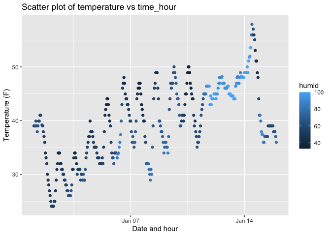

p8105_hw1_qh2284
================
Qin Huang
2023-09-15

# Problem 1

``` r
library(moderndive)
data("early_january_weather")
```

``` r
# To get a basic understanding of the dataset
?early_january_weather
head(early_january_weather)
```

    ## # A tibble: 6 × 15
    ##   origin  year month   day  hour  temp  dewp humid wind_dir wind_speed wind_gust
    ##   <chr>  <int> <int> <int> <int> <dbl> <dbl> <dbl>    <dbl>      <dbl>     <dbl>
    ## 1 EWR     2013     1     1     1  39.0  26.1  59.4      270      10.4         NA
    ## 2 EWR     2013     1     1     2  39.0  27.0  61.6      250       8.06        NA
    ## 3 EWR     2013     1     1     3  39.0  28.0  64.4      240      11.5         NA
    ## 4 EWR     2013     1     1     4  39.9  28.0  62.2      250      12.7         NA
    ## 5 EWR     2013     1     1     5  39.0  28.0  64.4      260      12.7         NA
    ## 6 EWR     2013     1     1     6  37.9  28.0  67.2      240      11.5         NA
    ## # ℹ 4 more variables: precip <dbl>, pressure <dbl>, visib <dbl>,
    ## #   time_hour <dttm>

- **Discuss the variables in this dataset, including names / values of
  important variables**

  There are total 15 variables.

  1.  origin: it shows the weather station. (values only contain EWR)
  2.  year, month, day, hour: time of recording. (values from 2013.01.01
      0 hour t0 2013.01.15 23 hour)
  3.  temp, dewp: temperature and dewpoint in F. (values varies)
  4.  humid: relative humidity. (values varies)
  5.  wind_dir, wind_speed, wind_gust: wind direction in degrees, wind
      speed in mph, and gust speed in mph (some missing values in
      wind_gust). (values varies)
  6.  precip: precipitation in inches. (values varies)
  7.  pressure: Sea level pressure in millibars. (values varies, some
      missing values)
  8.  visib: visibility in miles. (values varies)
  9.  time_hour: date and hour of the recording as a POSIXct date.

------------------------------------------------------------------------

``` r
#calculate the size of the dataset

cols = early_january_weather %>%
  ncol()

rows = nrow(early_january_weather)

cols
```

    ## [1] 15

``` r
rows
```

    ## [1] 358

- **The size of the dataset:** `early_january_weather` dataset has 358
  rows and 15 cols (represents 15 variables and 358 observations)

------------------------------------------------------------------------

``` r
# calculate the mean temperature
mean_temp = mean(early_january_weather$temp,na.rm=T) #get rid of the missing values if any

mean_temp
```

    ## [1] 39.58212

- **The mean temperature:** `early_january_weather` dataset has a mean
  temperature of 39.58212 F.

------------------------------------------------------------------------

``` r
# Make a scatterplot of temp (y) vs time_hour (x)

library(ggplot2)
plot_p1 = early_january_weather %>%
  ggplot(aes(x = time_hour, y = temp, color = humid))  +
  geom_point() +
  labs(x = 'Date and hour', y = 'Temperature (F)', title = 'Scatter plot of temperature vs time_hour')

plot_p1
```

<!-- -->

``` r
ggsave("Scatter plot.png", plot = plot_p1)
```

    ## Saving 7 x 5 in image

- **The patterns that are apparent in this plot**

  The trend of temperature and humidity changes in every day is roughly
  the same, during the day the temperature is high and the humidity is
  high, and in the evening and night the temperature is low and the
  humidity is low.

# Problem 2
